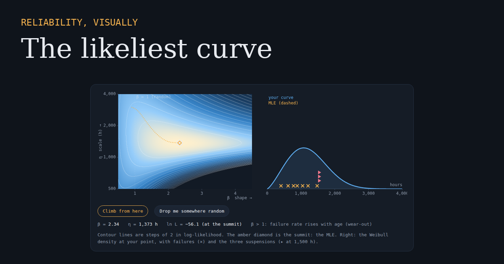

# Reliability, Visually

Interactive, visual explainers of reliability engineering, where every graph is live: drag it, slide it, and build the intuition that formulas leave out.

**Visit the site: [luckynp85.github.io](https://luckynp85.github.io)**

## Articles

| Article | What you'll learn |
|---|---|
| [The likeliest curve](https://luckynp85.github.io/mle/) | What Maximum Likelihood Estimation really does, why suspended units matter, and when MLE beats rank regression on Weibull paper |
| *Weibull vs lognormal* | Coming soon |

## About

Written by [Laxman Pangeni](https://www.linkedin.com/in/laxman-pangeni/), reliability engineer and author of the [Reliability by Design](https://accendoreliability.com/articles/on-product-reliability/reliability-by-design/) series on Accendo Reliability.

Each article is a single self-contained HTML page with no frameworks and no tracking. All calculations run in your browser.

Found an error or have an idea for the next explainer? [Open an issue](https://github.com/luckynp85/luckynp85.github.io/issues).
